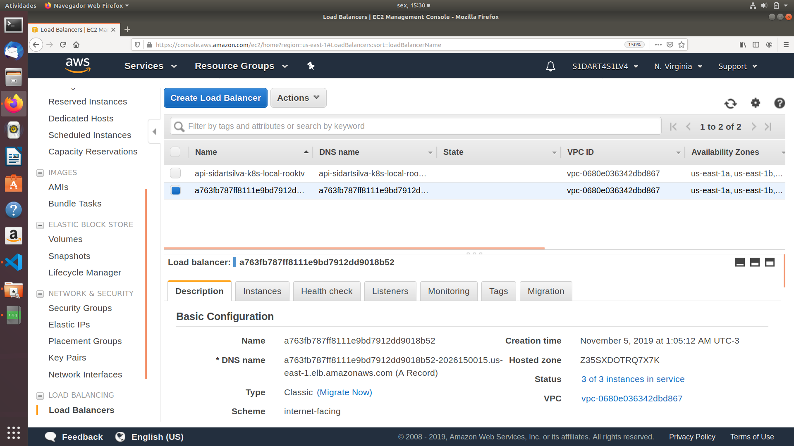
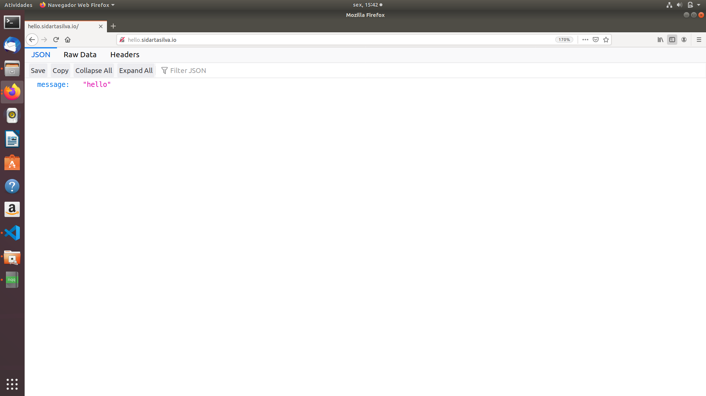
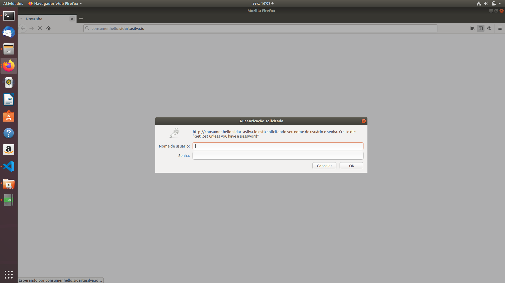
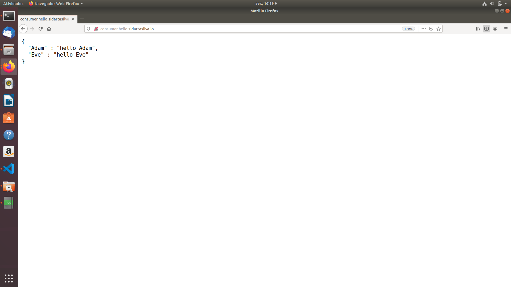

# Project 003 - Calling the Service More than Once

This project is based on the references below.

    ESCOFFIER, C. Building Reactive Microservices in Java Asynchronous and Event-Based Application Design. First Edition. California: O’Reilly Media, Inc., 2017.

    RedHat Developer, accessed 1 November 2019, <https://developers.redhat.com/promotions/building-reactive-microservices-in-java>

    Kubernetes Hands-On - Deploy Microservices to the AWS Cloud 2018, Udemy, accessed 1 November 2019, <https://www.udemy.com/course/kubernetes-microservices>

### Project Creation

    mkdir project003
    cd project003

    mvn io.fabric8:vertx-maven-plugin:1.0.5:setup \
      -DprojectGroupId=io.vertx.sidartasilva.microservice \
      -DprojectArtifactId=project-003 \
      -Dverticle=io.vertx.sidartasilva.http.HelloConsumerMicroservice \
      -Ddependencies=web,web-client,rx

Now let’s change the current behavior to call the Hello Microservicetwice with two different (path) parameters:
 

        HttpRequest<JsonObject> request1 = client
            .get(System.getenv("HOST"), "/Adam")
            .as(BodyCodec.jsonObject());
        HttpRequest<JsonObject> request2 = client
            .get(System.getenv("HOST"), "/Eve")
            .as(BodyCodec.jsonObject());

These two requests are independent and can be executed concurrently. But here we want to write a response assembling both results.

The code required to invoke the service twice and assemble the two results can become convoluted. We need to check to see whether or not the other request has been completed when we receive one of the responses. While  this  code  would  still  be  manageable for two requests, it becomes overly complex when we need to handle more.

Fortunately, we can use reactive programming and RxJava to simplify this code.

We instruct the vertx-maven-plugin to import the Vert.x RxJava API. In the HelloConsumerMicroservice, we replace the import statements with:

        import io.vertx.rxjava.core.AbstractVerticle;
        import io.vertx.rxjava.ext.web.*;
        import io.vertx.rxjava.ext.web.client.*;
        import io.vertx.rxjava.ext.web.codec.BodyCodec;
        import rx.Single;

With RX, the complex code we would have written to call the two requests and build a response out of them becomes much simpler:

    private void invokeMyFirstMicroservice(RoutingContext rc) {
          HttpRequest<JsonObject> request1 = client
              .get(System.getenv("HOST"), "/Adam")
              .as(BodyCodec.jsonObject());
          HttpRequest<JsonObject> request2 = client
              .get(System.getenv("HOST"), "/Eve")
              .as(BodyCodec.jsonObject());
              
          Single<JsonObject> s1 = request1.rxSend()
              .map(HttpResponse::body);
          Single<JsonObject> s2 = request2.rxSend()
              .map(HttpResponse::body);
          
          Single.zip(s1, s2, (adam, eve) -> {
              // We have the results of both requests in Adam and Eve
              return new JsonObject()
                  .put("Adam", adam.getString("message"))
                  .put("Eve", eve.getString("message"));
          })
          .subscribe(
              result -> rc.response().end(result.encodePrettily()),
              error -> {
                  error.printStackTrace();
                  rc.response().setStatusCode(500).end(error.getMessage());
              }

          );
    }

Notice the rxSend method calls. The RxJava methods from Vert.xare prefixed with rx to be easily recognizable.

The result of rxSend is a Single, i.e., an observable of one element representing the deferred result of an operation.

The single.zip method takes as input a set of Single, and once all of them have received their value, calls a function with the results.

Single.zip produces another Single containing the result of the function. Finally, we subscribe.
 
This method takes two functions as parameters:

1. The  first one is called with the result of the zip function (a JSON object). We  write the received JSON payload into the HTTP response.

2. The second one is called if something fails (timeout, exception,etc.). In this case, we respond with an empty JSON object.

With this code in place, if we open http://consumer.hello.sidartasilva.io and the hello microservice is still running we should see:

        {
            "Adam" : "hello Adam",
            "Eve" : "hello Eve"
        }

 
### Dockerfile

    FROM openjdk:8-jre-alpine
    ENV VERTICLE_FILE project-003-1.0-SNAPSHOT.jar
    ENV VERTICLE_HOME /usr/verticles
    EXPOSE 8085
    COPY $VERTICLE_FILE $VERTICLE_HOME/
    WORKDIR $VERTICLE_HOME
    ENTRYPOINT ["sh", "-c"]
    CMD ["exec java -jar $VERTICLE_FILE"]

### Loand Balancers and Ingress Controllers

On a professional cluster in the Cloud, Load Balancers are used.

Now, the load balancer is provided by your Cloud Provider, so for example Amazon Web Services or Google Cloud Platform or Azure or whoever. Basically any good Cloud Provider will have a load balancing solution.

Now these are essentially hardware resources that are highly available, highly resilient and have been absolutely battle tested by thousands of or even millions of projects over the last few years.

And the idea is that for a Service we define it to be of type LoadBalancer in our Yaml.

And that tells Kubernetes it needs to provision a Load Balancer so remember that is provided by for example AWS, it's not part of Kubernetes but it can be configured to forward traffic on a particular port.

Now there is a big problem with this. This is absolutely fine if you have one service that you want to publish to your end users.

But if you have more than one service that would mean creating another Load Balancer. And you're going to end up with a separate load balancer for every service that you want to publish to your end users.

And there is an advantage to this, the advantage is because the load balancers are completely separate hardware entities, and therefore will have different IP addresses, actually these will have different domain names.

But you probably see the massive disadvantage here is that load balancers are expensive items.

So there is a concept called an Ingress Controller in Kubernetes and this is the general solution to this problem and it will work on all Cloud Providers.

The idea behind an Ingress Controller is simple. We'll rework the architecture so that we have just one load balancer.

I can listen on any port you like, but it will typically be port 80 and instead of talking to the Services, we're going to configure things so it talks what is basically a special Service in Kubernetes called the Ingress Controller.

So it is just a Service but it is not a Service that we're actually going to write ourselves, it's sort of a predefined Service.

It is actually pluggable, you can get different implementations of Ingress Controllers but probably the one you'll be working with is just nginx.

All it will do is based on our configuration that we're going to give to this Controller, it will make routing decisions.

So, for example, it can decide based on the domain name that was requested, it can go to one service or another service. That is called fanning out.

It is obvious now that we can add as many Services as we like onto this Ingress Controller and all the way through will just be reusing the same load balancer.

So notice that there is still a load balancer in play here, we do still need that load balancer we have multiple nodes in a cluster and the load balancer is essential so that regardless of which nodes are currently running, our clients can reach our cluster.

So the load balancer is still a critical component, but we only need one of them.

## Yaml Files

Now we have two additional Yaml files for the Ingress Controller. One of them is for routing to the service that will become public, which is the Hello Microservice. And the other one will route traffic to the service that will require basic authentication, which is the Consumer Microservice.

### Ingress Public Yaml File

    apiVersion: extensions/v1beta1
    kind: Ingress
    metadata:
      name: public-routing
    spec:
      rules:
        - host: hello.sidartasilva.io
          http:
            paths:
              - path: /
                backend:
                  serviceName: project001
                  servicePort: 8080

### Ingress Secure Yaml File

    apiVersion: extensions/v1beta1
    kind: Ingress
    metadata:
      name: secure-routing
      annotations:
        nginx.ingress.kubernetes.io/auth-type: basic
        nginx.ingress.kubernetes.io/auth-secret: mycredentials
        nginx.ingress.kubernetes.io/auth-realm: "Get lost unless you have a password"
    spec:
      rules:
        - host: consumer.hello.sidartasilva.io
          http:
            paths:
              - path: /
                backend:
                  serviceName: project002
                  servicePort: 8081

And our Service Yaml files will have to be updated as well. They'll have to be altered for routing traffic to NodePort port type.

### Service project001 Yaml File

    apiVersion: v1
    kind: Service
    metadata:
      name: project001

    spec:
      selector:
        app: project001

      ports:
        - name: http
          port: 8080
      type: NodePort

### Service project002 Yaml File

    apiVersion: v1
    kind: Service
    metadata:
      name: project002

    spec:
      selector:
        app: project002

      ports:
        - name: http
          port: 8081
      type: NodePort

In the Ingress Yaml files we're able to see the definition of two hosts: hello.sidartasilva.io and consumer.hello.sidartasilva.io.

Those subdomains were registered by acquiring the domain sidartasilva.io at AWS with the service Route 53 from Amazon.

Each of these subdomains correspond to an alias record pointing to the Ingress elastic load balancer that we already have. 

## Calling Hello Microservice

Now let's check if our Hello Microservice is working. For that, let's make a call to hello.sidartasilva.io on the browser and see what happens.

It successfully returns the expected JSON payload:

    {
      "message":"hello"
    }

## Calling Consumer Microservice

Before showing up the Microservice call on the browser, we should remember that our ConfigMap Yaml file was updated as well with a new value for the host subdomain:

    apiVersion: v1
    kind: ConfigMap
    metadata:
      name: global-config
      namespace: default

    data:
      loadbalancer.host: "hello.sidartasilva.io"

This is the value (i.e., hello.sidartasilva.io) that will be passed in to the following code:

        HttpRequest<JsonObject> request1 = client
            .get(System.getenv("HOST"), "/Adam")
            .as(BodyCodec.jsonObject());
        HttpRequest<JsonObject> request2 = client
            .get(System.getenv("HOST"), "/Eve")
            .as(BodyCodec.jsonObject());

That way the Hello Microservice is called in by the Consumer Microservice.

And then let's at last check the response that is returned from making a call to the Consumer Microservice. 

As it was said before, the Consumer Microservice requires authentication. In that case, just fill the following data in:

    Username: admin
    Password: password

And it will return the expected JSON payload:

## Are These Microservices Reactive Microservices?

At this point we have two microservices. They are independent and can be deployed and updated at their own pace. They also interact using a  lightweight protocol (HTTP). But are they reactive micro‐services? 

No, they are not. Remember, to be called reactive a micro‐service must be:

* Autonomous

* Asynchronous

* Resilient

* Elastic

The main issue with the current design is the tight coupling between the two microservices. The web client is configured to target the first microservice  explicitly.  If  the first microservice fails, we won’t be able to recover by calling another one. If we are under load, creating a new instance of the hello microservice won’t help us. Thanks to the Vert.x web client, the interactions are asynchronous. However, as we don’t use a virtual address (destination) to invoke the microservice, but its direct URL, it does not provide the resilience and elasticity we need.

It’s important to note that using reactive programming as in the second microservice does not give you the reactive system’s benefits. It provides an elegant development model to coordinate asynchronous actions, but it does not provide the resilience and elasticity we need. Can we use HTTP for reactive microservices? Yes. But this requires some infrastructure to route virtual URLs to a set of services. We also need to implement a load-balancing strategy to provide elasticity and health-check support to improve resilience.

